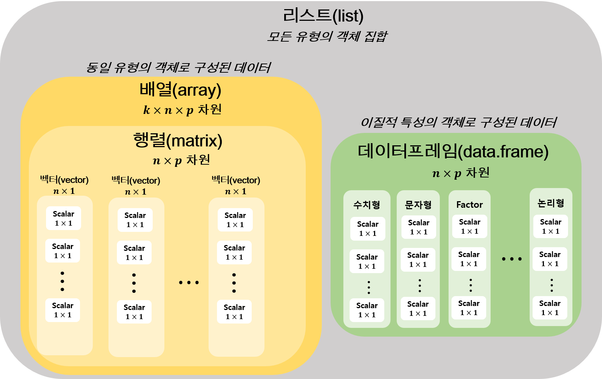

```{r knitr_init, echo=FALSE, results="hide", message=FALSE, cache=FALSE}
 
knitr::opts_knit$set(root.dir = '..') 
options(max.print = 5000)
knitr::opts_chunk$set(eval = TRUE, echo = FALSE, cache = FALSE, include = TRUE, collapse = FALSE, tidy=TRUE, message=FALSE, warning=FALSE, dependson = NULL, engine = "R", error = T, fig.path="Figures/", fig.align = "center", fig.width = 7, fig.height = 7, fig.keep='all', fig.retina=2, background = '#F7F7F7', highlight = T, comment = NA, tidy = TRUE, tidy.opts=list(blank=FALSE, width.cutoff=60))
```

## **목적**

1. **R의 기본 연산 방법 둘러보기**

2. **주어진 데이터프레임으로 자료 전처리 방법을 알아보기**

3. **전처리한 자료를 바탕으로 `ggplot()` 기반 그래프를 만들어 보기**


## **R의 데이터 유형**

- R은 객체지향(object-oriented) 언어

- 객체(object): 숫자, 데이터셋, 단어, 테이블, 분석결과가 저장되는 모든 것들을 칭함

> **"객체지향"의 의미는 R의 모든 명령어는 객체를 대상으로 이루어진다는 것을 의미**

### 객체 할당(assignment)

객체를 할당 지시자: `=`, `<-`

> **R의 동작은 객체에 함수명령을 할당하는 방식으로 명령이 실행됨**

- 두 할당 지시자의 차이점
    - `=`: 명령의 최상 수준에사만 사용 가능
    - `<-`: 어디서든 사용 가능
    
- 예시에 사용한 함수
    - `rm()`: R workspace에 존재하는 객체 삭제 함수
    - `c()`: 벡터 생성 함수
    - `mean()`: 입력 벡터의 평균 계산 함수
    
```{r assign-diff-01, echo = T, eval = T}
# 이전 히스토그램 생성 위해 생성한 x 삭제
# `mean()` 입력 벡터의 평균 계산
my <- mean(y <- c(1, 2, 3, 4, 5))
mx <- mean(x = c(1, 2, 3, 4, 5))
# 실행결과
my
mx
y
x
```

### 객체 명명 규칙

1. 알파벳, 한글, 숫자, `_`, `.`의 조합으로 구성 가능(`-`은 사용 불가)

2. 변수명의 알파벳, 한글, `.`로 시작 가능
    - `.`로 시작한 경우 뒤에 숫자 올 수 없음(숫자로 인지)

3. 대소문자 구분

4. 실습
    - 사용함수(프로토타입만 기술, 상세 함수 설명은 `help` 명령어로 확인)
        - `matrix(vector, nrow, ncol, byrow)`: 백터로부터 행렬 생성 함수 (참조: `help(matrix)`)
        - `seq(from, to, by)`: `from`에서 `to` 까지 `by` 간격으로 생성한 숫자열 반환 함수

> **참고** 문자열은 항상 큰 따옴표(`" "`) 안에 표기

```{r objectName-ex01, echo = T, eval = T}
# 1:10은 1부터 10까지 정수 생성
# 'c()'는 벡터 생성 함수
x <- c(1:10) 
# 1:10으로 구성된 행렬 생성
X <- matrix(c(1:10), nrow = 2, ncol = 5, byrow = T)
x
X
# 논리형 객체
.x <- TRUE
.x
# 알파벳 + 숫자
a1 <- seq(from = 1, to = 10, by = 2)
# 한글 변수명
가수 <- c("Damian Rice", "Beatles", "최백호", "Queen")
가수
```   

> **주의:** 아래와 같이 객체명을 지정하면 오류!!

```{r objName-ex02, echo = T, eval = T}
3x <- 7
```

```{r objName-ex03, echo = T, eval = T}
_x <- c("M", "M", "F")
```

```{r objName-ex04, echo = T, eval = T}
.3 <- 10
```

## R 객체

### 객체에 입력 가능한 값들

- **수치형(numeric)**: 숫자(정수, 소수)

- **문자열(string)**: `"충남대학교"`, `"R강의"`

- **논리형(logical)**: `TRUE`/`FALSE`

- **결측값(`NA`)**: 자료에서 발생한 결측 표현

- **공백(`NULL`)**: 지정하지 않은 값

- **요인(factor)**: 범주형 자료 표현(수치 + 문자 결합 형태로 이해하면 편함)

- **기타**: 숫자아님(`NaN`), 무한대(`Inf`) 등 수학적 표현(본 강의에서는 다루지 않음)

### 객체의 종류

- 스칼라(scalar)
- 벡터(vector): **R의 기본연산 단위**
- 행렬(matrix)
- 배열(array)
- 데이터프레임(data frame)
- 리스트(list)



## 스칼라(scalar)

1. 단일 차원의 값(하나의 값): $1 \times 1$ 벡터로 간주 가능
    - R 데이터타입의 기본은 벡터

> **참고: 스칼라를 입력시 R의 벡터 지정 함수인 `c()`를 꼭 사용해서 입력할 필요가 없다. 단, 두 개 이상 스칼라면 벡터이므로 꼭 c()를 써야 한다.**

2. 스칼라는 다음과 같은 값을 가질 수 있음

### 수치: 수치연산(`+, -, *, ^, **, /, %%, %/%`) 가능
```{r, echo = T, eval = T}
# 숫자형 스칼라
a <- 3
b <- 10
a
b
# 덧셈
c <- a + b
c
# 뺄셈
d <- b - a
d
# 곱셈
a*b
# 멱승
b^a
b**a
# 나누기
b/a
# 나누기 나머지 반환
b %% a
# 나누기 몫 반환
b %/% a
# 연산 우선순위
n <- (3+5)*3 - 4**2/2
n
```

### 문자값: 수치연산 불가능
```{r, echo = T, eval = T, prompt = T}
h1 <- "Hello CNU Hospital CTC."
g2 <- "R is not too difficult."
h1
g2
h1 + g2
```

### 논리값

- `TRUE, T`: 참
- `FALSE, F`: 거짓
- `&, && (AND); |, || (OR); ! (NOT)` 연산자 사용 가능
- 비교연산 숫자값들의 비교를 통해 논리값 반환
    - `>, <, >=, <=, ==, !=`
    - 문자형 비교 연산은 `==, !=`만 가능

> **참고 1: 논리형 스칼라도 숫자형 연산 가능하다. 왜냐하면 컴퓨터는 TRUE/FALSE를 1과 0의 숫자로 인식하기 때문이다.**

> **참고 2: `&`와 `&&`는 동일하게 AND를 의미하지만 연산 결과가 다르다. `&`의 연산 대상이 벡터인 경우 백터 구성 값 각각에 대해 `&` 연산을 실행 하지만 `&&`는 한 개(스칼라)에만  논리 연산이 적용된다(아래 예시 참고).**

```{r echo = T, eval = T, prompt = T}
TRUE & TRUE
TRUE & FALSE
TRUE | TRUE
TRUE | FALSE
!TRUE
!FALSE
# T/F는 각각 TRUE/FALSE의 전역변수
T <- FALSE
T
TRUE <- FALSE
T <- TRUE
# &와 &&의 차이
l1 <- c(TRUE, TRUE, FALSE, TRUE)
l2 <- c(FALSE, TRUE, TRUE, TRUE)

l1 & l2
l1 && l2

x <- 10
y <- 13

x > y
x < y
x >= y
x <= y

x == y
x != y
y <- 10
x != y
```

### 결측값

- 데이터 값이 없음을 의미
- 예를 들어 4명의 학생 중 3명의 수학 시험 점수가 80, 95, 90 점인데 한 학생의 점수를 모르는 경우 `NA`를 이용해 점수 표현
- `is.na()` 함수를 이용해 해당 값이 결측을 포함하고 있는지 확인

```{r, echo = T, eval = T}
one <- 80; two <- 95; three <- 90; four <- NA
four
# 'is.na()' 결측 NA가 포함되어 있으면 TRUE 반환
is.na(NA)
```

### NULL 값

- 초기화 되지 않은 값 표현
- `is.null()` 함수를 통해 NULL 지정 여부 확인

> **참고: NA와 NULL은 다르다!!**

```{r, echo = T, eval = T, prompt = T}
# NA와 NULL의 차이점
# 'is.null()' 객체 또는 변수에 NULL이 저장되어 있는지 판단
x <- NULL
is.null(x)
is.null(1)
is.null(NA)
is.na(NULL)
```

### 요인값

- 범주형 자료를 표현하기 위한 값
- 범주형 자료
   - 데이터가 사전에 정해진 특정 유형으로만 분류되는 경우
        - 성별, 인종, 혈액형 등
    - 범주형 자료는 명목형과 순서형으로 구분 가능
        - 순서형 자료 예: 성적, 교육수준, 선호도, 중증도 등 
- `factor()` 함수를 통해 표현 가능
    - 프로토타입: `factor(x, levels, labels, ordered)` (`help(factor)` 참조)
        - `x` 벡터(스칼라)에 대응하는 요인의 수준(`levels`)과 수준의 레이블(`levels`)을 지정. 만약 요인 `x`가 순서형이면 `ordered`인지 아닌지를 입력
    - 숫자형에 적용되는 연산 불가
    - 요인형을 조금 더 부연설명 하면 숫자 또는 문자 값에 수준의 속성을 부여한 값의 형태임

- 예시 사용 함수
    - `is.factor()`: 벡터(스칼라)가 요인형인지 확인
    - `nlevels()`: factor의 level 개수 반환
    - `levels()`: level 목록 반환
    - `labels()`: level에 대응하는 label 목록 반환
    - `ordered()`: 순서형 factor 생성
    - `is.ordered()`: 순서형 factor 확인
```{r eval = T, echo = T, prompt = T}
# factor() 기본 사용법
# factor(x, levels, labels, ordered = F)
# x: factor 형으로 지정하고자 하는 스칼라 또는 벡터
# levels: factor의 수준 지정
# labels: factor의 레이블 지정
sex <- factor("M", levels = c("M", "F"))
sex
# factor 형 판단 TRUE/FALSE
is.factor(sex)
# factor의 level 개수 반환
nlevels(sex)
# factor의 level 목록 반환
levels(sex) 
# factor의 level 목록 수정
levels(sex) <- c("Male", "Female")
sex

# 순서형 factor
severity <- factor(1, levels = c(1, 2, 3), labels = c("Mild", "Moderate", "Severe"))
# severity <- ordered(severity)
# 또는 factor() 함수 내에서 ordered 옵션을 TRUE로 지정
severity <- factor(1, levels = c(1, 2, 3), labels = c("Mild", "Moderate", "Severe"), ordered = TRUE)
severity
is.ordered(severity)
```

## 벡터

- 동일한 유형의 자료가 2개 이상 1차원 ($n \times 1$, $n \geq 2$) 으로 구성되어 있는 구조
- 벡터는 앞의 예시에서 본 바와 같이 `c()` 함수를 사용해 생성
- 서로 다른 자료형으로 벡터를 구성한 경우 표현력이 돞은 자료형으로 변환한 값 반환
    - 예: 문자열 + 숫자로 구성된 벡터 $\rightarrow$ 문자형 벡터
- 벡터 각 원소에 이름 부여 가능
    - `names()` 함수를 이용해 원소 이름 지정
        - 사용 프로토타입: `names(x) <- 문자열 벡터`, 단 `x`와 이름에 입력할 문자열 벡터의 길이는 같아야 함. 
    - 벡터의 길이(차원) 확인
        - `length()` 또는 `NROW()` 사용
- 색인(indexing)을 통해 벡터의 원소에 접근 가능
    - `x[i]`: 벡터 `x`의 `i`번 째 요소
    - `x[-i]`: 벡터 `x`에서 `i`번 째 요소를 제외한 나머지
    - `x[I]`: `I`가 인덱싱 벡터라고 할 때 `I`에 지정된 요소를 얻어옴. 보통 `I`는 행번호 또는 각 원소의 이름을 표현하는 벡터
    - `x[start:end]`: `x`의 `start`부터 `end`까지 값 반환
    
- 벡터의 원소가 `NULL`을 포함한 경우 해당 원소가 완전히 삭제(예시 참조)

> **참고: 벡터 생성 시 알아두면 유용한 함수 `seq()`, `seq_along()`, `rep()` (예시 참조) **

> **`seq_along(x)`: `x`의 길이(length) 만큼 숫자 시퀀스 생성**

> **`rep(x, each, times)`: 벡터 x의 개별 원소를 `each`만큼 반복하거나 벡터 x 전체를 `times`만큼 반복 (예시 참조)**

- 예시 사용 함수
    - `is.numeric()`: 벡터가 숫자형인지 판단하는 함수
    - `is.character()`: 벡터가 문자형인지 판단하는 함수
    - `is.logical()`: 벡터가 논리형인지 판단하는 함수
    - `names()`: 객체의 이름 반환
    - `str()`: 객체의 속성구조 특징 반환

```{r echo = T, eval = T}
# 숫자형 벡터
x <- c(1:25)
y <- c(26:50)
is.numeric(x)

# 벡터의 연산
## 사칙연산
x + y
x - y
x/y
x*y

## 비교 연산
a <- c(1, 2, 3, 3, 4, 2, 5, 1, 2, 3, 4, 4, 4)
b <- c(2, 2, 4, 4, 3, 2, 5, 1, 2, 4, 4, 4, 3)

a > b
a >= b
a < b
a <= b
a == b
a != b

# 벡터의 길이: `length()` 또는 `NROW` 함수 이용
z <- 1
length(z)
NROW(x)

# 문자형 벡터
str1 <- c("Boncho Ku", "Linear Regression", "307", "Male")
str1
# 벡터 원소의 이름 지정
names(str1) <- c("Name", "Subject", "Room", "Sex")
str1
is.numeric(str1)
is.character(str1)

# 숫자와 문자를 동시에 포함한 벡터라면? 
vec1 <- c(1, 2, 5, "1", "Clinical Trial") 
### 모두 문자열으로 변환된 벡터 

# 논리형 벡터
boolen <- c(TRUE, TRUE, FALSE, TRUE, TRUE, TRUE, FALSE, FALSE)
is.numeric(boolen)
is.logical(boolen)

# 결측을 포함한 벡터
vecNA <- c(1:10, NA, NA)
is.na(vecNA)
is.numeric(vecNA)

# NULL 포함 벡터
vecNULL <- c(NULL, 1, 2, NULL, 3)
vecNULL

# seq_along(), rep() 함수 사용 
seq_along(x)
z <- c(3,8)
# `rep(x, each)` 사용 예
rep(z, each = 3)
# `rep(x, times)` 사용 예
rep(z, times = 3)
# `rep(x, each, times)` 사용 예
rep(z, each = 2, times = 3)

# 요인 벡터
## rep() 함수를 이용한 0,1 벡터 생성
sex <- rep(c(0,1), each = 10)
sex
sex <- factor(sex, levels = c(0,1), labels = c("Male", "Female"))
sex
str(sex)

# 벡터의 색인
x[10]
x[-3]
x[1:5]
x[c(1:3, 10:12)]
x[-c(1:10)]
str1["Name"]
```

### 벡터의 연산

위에서 기술한 연산자 이외, 알아두면 유용한 벡터 연산자들

1. 벡터는 숫자, 문자열 등 어떤 특정 값들의 묶음으로 볼 수 있기 때문에 집합 연산 가능
    - `identical(x, y)`: 객체 `x`와 객체 `y`가 동일한지 판단
    - `union(x, y)`: 객체 `x`와 객체 `y`의 합집합
    - `intersection(x, y)`: 객체 `x`와 객체 `y`의 교집합
    - `setdiff(x, y)`: 객체 `x`와 객체 `y`의 차집합
    - `x %in% y` :`y`에 `x`의 원소가 포함되어 있는지 판단

```{r, echo = T, eval = T}
x <- c(1:3)
y <- c(1:3)
identical(x, y)

y <- c(1,2,4)

identical(x, y)
union(x, y)
intersect(x, y)
setdiff(x, y)
setdiff(y, x)

x %in% y
```

## 행렬

- 동일한 유형의 2차원 데이터 구조 ($n \times p$ 자료행렬)
    - $n \times 1$ 차원 벡터 $p$개로 묶여진 데이터 덩어리
- 행렬 관련 함수 프로토타입
    - `matrix(data, nrow, ncol, byrow = FALSE, dimnames= NULL)`: `data`를 열의 개수가 `nrow`이고 열의 개수가 `ncol`인 행렬을 생성한다. 여기서 `byrow = FALSE` 열 우선으로 행렬의 entry를 채우고, `byrow = TRUE`이면 행 우선으로 행렬의 entry를 채운다
    - `dimnames[[i]] <- value`: 행렬의 이름을 설정하는 함수
        - `i=1`이면 행, `i=2`이면 열을 의미하며
        - `value`는 지정할 이름을 포함하고 있는 벡터이며 각 행과 열의 길이와 동일한 길이를 갖는다. 
    - `rownames(X)`: 행의 이름을 가져온다
        - `rownames(X) <- value`: 행의 이름을 지정
    - `colnames(X)`: 열의 이름을 가져온다
        - `colnames(X) <- value`: 열의 이름을 지정
    - `NROW(X)`, `nrow(X)`: 행렬 `X`의 행 길이 반환
    - `NCOL(X)`, `ncol(X)`: 행렬 `X`의 열 길이 반환
    - `dim(X)`: 행렬 `X`의 차원 반환
- 행렬 색인: 행과 열의 번호 또는 이름으로 인덱싱 가능
    - 행렬의 행과 열은 꺽쇠 `[]' 안에서 `,` (콤마)로 구분
    - `X[idx_row, idx_col]`: 행렬 `X`의 `idx_row` 행, `idx_col`행에 저장된 값 반환 
        - `idx_row`, `idx_col`을 지정하지 않으면 전체 행 또는 열을 선택
- 행렬 연산
    - 행렬과 스칼라: 사칙연산 가
    - 행렬과 행렬: 같은 차원의 행렬에 대해 `+, -` 연산 가능
    - 행렬과 행렬의 곱: `X %*% Y` 이때 `X`의 열과 `Y`의 행의 길이는 같아야 함
    - 행렬의 전치: `t(X)`
    - 정방행렬(행과 열의 길이가 같은 행렬)의 역행렬 구하기: `solve(X)`
```{r matrix-ex, echo = T, eval = T}
# 행렬 생성
X <- matrix(c(1:9), nrow = 3, ncol = 3, byrow = FALSE)
Y <- matrix(c(1:9), nrow = 3, ncol = 3, byrow = TRUE)
X
Y
# 행렬 X에 행렬 이름 지정:`rownames()`, `colnames()` 사용
rownames(X) <- c(1, 2, 3)
colnames(X) <- c("A", "B", "C")
dimnames(X)
# 행렬의 행/열 길이 차원 반환
nrow(X)
ncol(X)
dim(X)

# 행렬 색인
X[1, 2]
X[1:2, ]
X[, 2:3]
X[, c("A","B")]
X[c("2", "3"), ]

# 행렬 연산
# 행렬-스칼라 또는 벡터
X + 1
X - 3
X * 2
X / 3

z <- c(1:3)
z
X + z
X - z
X * z
X / z
# 행렬-행렬
Y <- matrix(c(10:18), nrow = 3, ncol = 3, byrow = TRUE)
Z <- matrix(c(1:6), nrow = 3, ncol = 2) # 확인용
Y
Z

X + Y
X - Y

X + Z
X - Z
X * Z

# 역행렬 계산
X <- matrix(c(1:4), ncol = 2)
X
Xinv <- solve(X)
Xinv
X %*% Xinv
```

### 배열

- 동일한 유형의 데이터가 2차원 이상으로 구성된 구조 
    - 동일 차원($n\times p$)의 행렬 $k$개의 방에 저장되어 있는 구조

```{r, echo = T, eval = T, prompt = T}
# 1~24까지의 숫자를 '2 x 3 행렬'로 해서 '4층' 짜리의 데이터 구조를 만들어라
a1 <- array(1:24, c(2,3,4))
a1
# 1~24까지의 숫자를 '3 x 4' 행렬로 해서 '2층'짜리의 데이터 구조를 만들어라
a2 <- array(1:23, c(3,4,2))
a2
# 출처: http://rfriend.tistory.com/14?category=601862 [R, Python 분석과 프로그래밍 (by R Friend)]
```

### 리스트

```{r echo = T, eval = T, prompt = T}
# Vector(L1), Matrix(L2), Array(L3), Data Frame(L4)를 만들어서, 하나의 List(L5)로 묶어라

L1 <- c(1, 2, 3, 4) # Vector
L2 <- matrix(1:6, 3, byrow=TRUE) # Matrix
L3 <- array(1:24, c(3,4,2)) # Array
L4 <- data.frame(cust_id = c(1, 2, 3, 4), last_name = c("Kim", "Lee", "Choi", "Park")) # Data Frame
L5 <- list(L1, L2, L3, L4) # List
# [[1]]는 Vector(L1), [[2]]는 Matrix(L2), [[3]]는 Array(L3), [[4]]는 Data Frame(L4)가 묶인 것임
L5
# 출처: http://rfriend.tistory.com/14?category=601862 [R, Python 분석과 프로그래밍 (by R Friend)]
```

## 데이터 프레임

- Excel 스프레드시트와 같은 형태
- 데이터 프레임은 데이터 유형에 상관없이 2차원 형태의 데이터 구조
- 행렬과 유사한 구조를 갖고 있지만 각기 다른 유형의 자료형을 사용할 수 있다는 점에서 행렬과 차이
- R에서 가장 많이 사용되고 있는 데이터 유형이므로 매우 중요

> **참고: 행렬은 동일한 유형의 자료형으로 이루어짐**

> **유용함수: `ls()` $\rightarrow$ 작업공간(메모리)에 존재하는 객체 리스트 출력**

- 다음은 일반적인 데이터프레임 형태

```{r echo = F}
# library(knit)
df <- data.frame(성명 = c("홍길동", "박길동", "김길동"), 
                 국어 = c(80, 97, 85), 수학 = c(94, 100, 76))
knitr::kable(df)
```

- 데이터프레임 생성 및 관련 명령어
    - 데이터프레밍 생성 삼수
        - `DF <- data.frame(V1 = vector1, V2 = vector2, ...)`: 벡터 `V1`, `V2` 등으로 데이터프레임 `DF` 생성
            - `help(data.frame)` 참고 요망
    - 데이터 프레임 사용 문법
        - `DF$colname`: 데이터 프레임 `DF`에서 변수명 `colname`에 접근
        - `DF$colname <- x`: 데이터 프레밍 `DF`에 `colname`의 변수명을 갖는 열에 `x`를 저장. 여기서 `x`의 길이와 `DF` 행의 길이는 같아야 제대로 저장
        - 데이터프레임 색인
            - `DF$colname`
            - `DF[i, j, drop = T]`: 행렬과 유사한 형태로 `DF`의 `i`번째 행과 `j`번째 열의 원소 지정
                - 행이름 및 컬럼이름으로 지정 가능
                - `DF[, j]`처럼 특정 컬럼만 가져올 수 있음. 
                    - 하나의 컬럼만 선택한 경우 자동으로 벡터 변환
                    - 이를 방지하기 위한 옵션이 `drop = F`
                - `DF[-i, -j]`: `i`번째 행과 `j`번째 열을 제외한 나머지 반환
    - 많이 활용되는 데이터프레임 유틸리티 함수
        - `is.data.frame()`으로 데이터프레임 여부 확인
        - `names(DF)`: 데이터프레임 `DF`의 변수명 출력
            - `names(DF)[j] <- "vname1"`: `DF`의 `j`번째 열에 해당하는 변수명을 `"vname1"`로 바꾸기
        - `with(DF, 명령문)`: `DF` 내에서 `DF$` 사용 없이 변수명 사용하고 싶을 때
        - `head(DF)`, `tail(DF)`: 자료의 처음 또는 마지막 행(보통 5개 행) 부분 반환
        - `str(DF)`: 자료의 내부구조 확인
        - `View(DF)`
        - `summary(DF)`

```{r dataframe-ex, echo = T, eval = T}
# 데이터프레임 생성
rm(list = ls()) # 메모리상 모든 객체 삭제하는 명령어!!

ID <- c(1:10)
SEX <- rep(c(0,1), each = 5)
SEX <- factor(SEX, levels = c(0, 1), labels = c("Female", "Male"))
AGE <- c(34, 22, 54, 43, 44, 39, 38, 28, 31, 42)
AGE2 <- c(32, 22, 52, 41, 44, 39, 35, 28, 31, 40)
AGE3 <- c(32, 22, 52, 41, 44, 39, 35, 28, 31)
DBP <- c(112, 118, 132, 128, 128, 124, 121, 119, 124, 109)
HEIGHT <- c(165, 158, 161, 160, 168, 172, 175, 182, 168, 162)
WEIGHT <- c(52, 48, 59, 60, 48, 72, 73, 82, 64, 60)

DF <- data.frame(ID = ID, Sex = SEX, Age = AGE, DBP = DBP, HEIGHT = HEIGHT, WEIGHT = WEIGHT)

# DF 확인
str(DF); names(DF); ncol(DF); nrow(DF); dim(DF)

# 데이터 프레임 자료 확인
DF$Age

# 데이터프레임 변수 값 변환: DF$AGE를 AGE2로 변경
DF$Age <- AGE2
DF$Age

# 만약 입력하고자 하는 벡터의 길이가 DF의 행길이와 다르다면?
DF$Age <- AGE3

# 데이터 프레임에 BMI라는 변수를 추가하고 싶다면?
DF$Age <- AGE
DF$BMI <- WEIGHT/((HEIGHT/100)^2)
dim(DF)
DF

# 데이터프레임 색인
## 6 번째 대상자의 성별확인
DF[6, 2]; DF[6, "Sex"]
## ID, 성별, BMI만 추출
DF[, c(1,2,7)]; DF[, c("ID", "Sex", "BMI")]; DF[, names(DF) %in% c("ID", "Sex", "BMI")]

## 남자만 추출
DF[Sex == "Male", ]
DF[DF$Sex == "Male", ]; with(DF, DF[Sex == "Male", ])

## 첫 번째 대상자와 아이디 정보 제외
DF[-1, -1]

head(DF); tail(DF)

# 데이터프레임을 스프레드시트 형태로 보기
# View(DF)

# 데이터프레임 요약 통계량
summary(DF)
```
 
## 자료 전처리 

**목적**

1. **파일 입출력 마스터**
2. **`dplyr` 패키지를 이용해 DBP 자료 전처리 실습**

### 데이터 입출력

#### Excel 파일 불러오기 

> **불러올 데이터: `output/DBP.xlsx`**

> **사용 패키지: `readxl`, `readr`**

- 사용함수
    - **`read_xlsx()`**
    - **`write_excel_csv()`**
    - **`save()`**

1. RStudio 메뉴로부터 불러오기
    - [메뉴] -> [Import Dataset] -> [Browser]에 파일경로 및 파일명 지정

2. `readxl` 패키지를 이용해서 불러오기
    - `read_xlsx()` 함수를 이용
        -`read_xlsx(path, sheet, col_names)`: `path`(파일경로가 포함된 엑셀 파일명)에 해당하는 엑셀 파일에서 `sheet`의 변수명이 존재하는 데이터를 불러오기
```{r read-excel, echo = T}
# install.packages()
library(tidyverse)
library(readxl)
DBP <- read_xlsx(path = "output/DBP.xlsx", sheet = 1, col_names = T)
head(DBP)
```

3. `read_excel_csv()` 함수를 이용해 `TRT == "A"`인 데이터 셋 내보내기
    - `read_excel_csv(data, 파일경로/파일명)`: data를 지정한 파일경로에 지정한 파일명으로 저장
    - 이번 실습에서는 `output/DBP2.csv`로 저장
    
```{r write-data, echo = T}
DBP2 <- with(DBP, DBP[TRT == "A", ])
write_excel_csv(DBP2, path = "output/DBP2.csv")
```

4. 작업공간 저장하기 
    - `save()` 함수를 이용해 현재 작업공간(메모리) 상 존재하는 객체 저장
    - R 작업공간 저장파일의 확장자는 ".Rdata"
    - `output/실습1.Rdata`로 현재 존재하는 모든 객체를 저장
    - `output/실습2.Rdata`로 `DBP`, `DBP2`, `DF` 자료 저장

```{r save-data, echo = T}
# 모든 객체 저장
save(list = ls(), file = "output/실습1.Rdata")

## 선택 객체 저장
save(DBP, DBP2, DF, file = "output/실습2.Rdata")
```

### `dplyr` + `tidyr` 패키지를 이용한 데이터 전처리 예

- Hadley Wickham이 작성한 자료 전처리 특화 R Package
- 명령어가 직관적이고 사용하기 쉬움
- Chain (`%>%`, RStudio에서는 [Ctrl] + [Shift] + [M] 단축기 제공)이라는 연산자를 통해 각각의 데이터 조작을 연결해서 사용 가능
    - 최종 결과를 얻기 위한 불필요한 데이터프레임 생성 비율이 낮아짐
- 패키지 설치는 최근 `tidyverse`를 설치하면 자동적으로 두 개 패키지를 설치

> **참고: dplyr 패키지 간략한 사용법은 https://github.com/rstudio/cheatsheets/raw/master/source/pdfs/data-transformation-cheatsheet.pdf 와 http://had.co.nz/ggplot2/ 참조**

- `dplyr` + `tidyr` 전처리를 위한 기본함수
```{r dplyr-table, echo = F}
함수명 <- c("filter()", "select()", "mutate()", "arrange()", "group_by", "summmarise()", "gather()", "spread()", "separate()")
패키지 <- c("dplyr", "dplyr", "dplyr", "dplyr", "dplyr", "dplyr", "tidyr", "tidyr", "tidyr")
내용 <- c("지정 식에 맞는 데이터 추출", "열의 추출", "열 추가 및 변환", "정렬", "지정한 열의 수준으로 그룹화", "자료 요약", "Long-format 데이터셋 생성", "Wide-format 데이터셋 생성", "문자열 분리 후 변수 생성")

tab2 <- data.frame(함수명, 패키지, 내용)
knitr::kable(tab2)
```

> **`dplyr`의 일반적 사용 형태: `data %>% operation() %>% operation()`**

1. 예제 1: `iris` 데이터셋
    - 통계학자인 피셔Fisher가 소개한 데이터
    - 붓꽃의 3가지 종(setosa, versicolor, virginica)에 대해 꽃받침(sepal)과 꽃잎(petal)의 길이와 너비를 정리한 데이터
```{r iris-desc, echo = F}
data(iris)
변수명 <- names(iris)
설명 <- c("꽃받침 길이", "꽃받침 너비", "꽃잎 길이", "꽃잎 너비", "붓꽃의 종(setosa, versicolor, virginica)")
타입 <- c("numeric", "numeric", "numeric", "numeric", "factor")

tab3 <- data.frame(변수명, 설명, 타입)
knitr::kable(tab3)
```

> **문제 1**

1. iris 데이터에서 setosa 종만 뽑아
2. Sepal.Length와 Sepal.Width 변수를 추출 후 
3. 두 변수를 더한 새로운 변수 `Sepal_sum`을 만들고 동시에 `Sepal_sum`을 제곱한 변수 `Sepal_square` 컬럼 추가 후
4. `Sepal_sum` 기준으로 내림차순 하기

```{r dplyr-ex-01, echo = T}
data(iris)
library(tidyverse)

Q1 <- iris %>% 
  filter(Species == "setosa") %>% 
  select(Sepal.Length, Sepal.Width) %>% 
  mutate(Sepal_sum = Sepal.Length + Sepal.Width, 
         Sepal_square = Sepal_sum ^2) %>% 
  arrange(desc(Sepal_sum)) # `desc()` dplyr 패키지에서 제공하는 내림차순 반환 함수

head(Q1)
```

> **문제 2**

1. DBP 자료에서 성별(`Sex`)과 처리군(`TRT`)를 요인형으로 바꾸고 
2. `Subject`는 문자형으로 변경한 뒤
3. `DBP1`부터 `DBP5`에 측정값을 `value`라는 변수에 모으고, `DBP1`부터 `DBP5`의 변수명을 `VISIT`라는 변수에 저장 후
4. `tmp`의 형태 변수명 + 숫자를 `DBP`와 `VISIT`으로 나눈 뒤 `DBP`를 버린 후
5. `VISIT`을 숫자형으로 변환(숫자형 변환은 `as.numeric()` 함수 사용)

```{r dplyr-ex-02, echo = T}
mDBP <- DBP %>% 
  mutate(Sex = factor(Sex), 
         TRT = factor(TRT)) %>% 
  gather(tmp, value, DBP1:DBP5) %>% 
  separate(tmp, c("DBP", "VISIT"), sep = "P") %>% 
  select(-DBP) %>% 
  mutate(VISIT = as.numeric(VISIT))
```

> **문제 3**

1. **문제 2**와 동일하게 1-3 과정을 진행한 후(단 `tmp`를 `Visit`으로 바꿔서), 
2. 각 `TRT`에 따른 `VISIT` 별 평균을 계산한 뒤, 
3. 다시 `VISIT`의 각 `DBP1`부터 `DBP5`의 수준을 wide-format으로 변경
4.
5.


```{r dplyr-ex-03, echo = T}
mDBP2 <- DBP %>% 
  mutate(Sex = factor(Sex), 
         TRT = factor(TRT)) %>% 
  gather(VISIT, value, DBP1:DBP5) %>% 
  group_by(TRT, VISIT) %>% 
  summarise(Mean = mean(value)) %>% 
  ungroup(.) %>% #group화 된 변수는 펼치거나 모을 수 없어서 그룹지정 해지 함수 사용
  spread(VISIT, Mean)

```


## `ggplot2` 패키지를 이용한 그래픽 생성

- Hadley Wickham이 만든 Lee Wilkinson의 "Grammar of graphics" 기반 R 그래픽 패키지
- Grammar of graphics의 개념
    - 자료(data)를 각 기하학적인 객체(**geom**etric object 예: 점, 선, 면 등)에 미적(**aes**thetic) 속성을 2차원 좌표공간(**coord**inate)상에 매핑 시켜 그래픽을 생성하는  체계
- `ggplot`의 기본 사용
    - `data(mtcars)`
```r
[, 1]	 mpg	 Miles/(US) gallon
[, 2]	 cyl	 Number of cylinders
[, 3]	 disp	 Displacement (cu.in.)
[, 4]	 hp	 Gross horsepower
[, 5]	 drat	 Rear axle ratio
[, 6]	 wt	 Weight (1000 lbs)
[, 7]	 qsec	 1/4 mile time
[, 8]	 vs	 V/S
[, 9]	 am	 Transmission (0 = automatic, 1 = manual)
[,10]	 gear	 Number of forward gears
[,11]	 carb	 Number of carburetors
```
    
> **`data` + `geom` $\rightarrow$ graph**

- 기본적으로 `ggplot()` 함수를 사용

```{r ggplot-ex-01, echo = T}
data(mtcars)
ggplot(data = mtcars) + aes(x = hp, y = mpg, color = factor(cyl), shape = factor(cyl)) + geom_point(size = 4)
```

- 기본함수
    - `ggplot()`
    - `aes()`
    - `geom` 계열 함수
        - `geom_point()`: 산점도
        - `geom_line()`: 선도표
        - `geom_boxplot()`: 상자그림
        - `geom_bar()`: 막대그림
        - `geom_errorbar()`: 오차막대
        - 그외 다수
    - `scale` 계열함수
    - `facet` 계열함수
    - `theme` 계열 함수
    
> 예제: DBP 자료

DBP 자료를 처리군 별로 성별에 따른 visit별 혈압 별 평균에 대한 프로파일 도표(표준편차 포함) 만들기

```{r ggplot-ex-2}
library(ggthemes)

mDBP2 <- DBP %>% 
  mutate(Sex = factor(Sex), 
         TRT = factor(TRT)) %>% 
  gather(VISIT, value, DBP1:DBP5) %>% 
  group_by(TRT, Sex, VISIT) %>% 
  summarise(Mean = mean(value), 
            SD = sd(value)) %>% 
  ungroup(.) %>% 
  mutate(VISIT = factor(VISIT, levels = unique(VISIT)))

ggplot(mDBP2) + aes(x = VISIT, y = Mean, colour = Sex) + 
  geom_errorbar(aes(ymin = Mean - SD, ymax = Mean + SD), position = position_dodge(0.8)) + 
  geom_point(position = position_dodge(0.8)) + 
  geom_line(position = position_dodge(0.8)) + 
  facet_grid(~ TRT) + theme_base()

```


        
        
        
        
        
        
        
        
        
        
        


